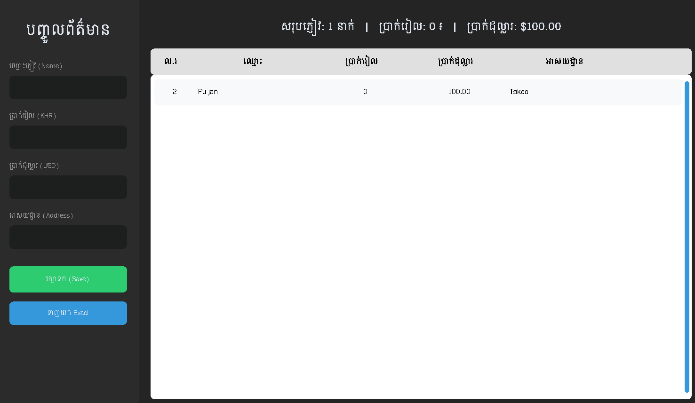

"# Wedding Manager / Wedding Cash Record

ប្រព័ន្ធកត់ចំណងដៃ Skurt Skurt

A modern desktop application for managing wedding guest lists and monetary gifts with full Khmer language support.

## Features

- ✅ **Full Khmer Font Support** - Properly displays Khmer Unicode text
- 💰 Track monetary gifts in both KHR (Riel) and USD (Dollar)
- 👥 Maintain guest information with addresses
- 📊 Real-time summary statistics
- 📤 Export data to Excel (.xlsx)
- 🎨 Modern UI with CustomTkinter
- 💾 SQLite database for reliable data storage

## Demo



_Wedding Manager application showing the guest list with Khmer language support, including guest names, monetary gifts tracking, and summary statistics._

## Khmer Font Support

The application automatically detects and uses available Khmer fonts on your system:

- Khmer OS Siemreap (preferred)
- Khmer OS Battambang
- Khmer OS
- Hanuman
- Koulen

### Installing Khmer Fonts (Windows)

If Khmer text displays as boxes or question marks, install Khmer fonts:

1. **Download Khmer OS Fonts:**
   ///
2. **Install Fonts:**
   - Extract the downloaded ZIP file
   - Right-click on `.ttf` font files
   - Select "Install" or "Install for all users"
   - Restart the application

## Installation

1. **Install Python 3.8 or higher**

2. **Install dependencies:**

   ```bash
   pip install -r requirements.txt
   ```

3. **Run the application:**
   ```bash
   python main.py
   ```

## Building Executable

To create a standalone .exe file:

```bash
pip install pyinstaller
pyinstaller WeddingManager.spec
```

The executable will be in the `dist/` folder.

## Configuration

Create a `.env` file (copy from `.env.example`) to customize:

```env
DB_NAME=wedding_data.db
APP_TITLE=Wedding Manager
FONT_NAME=Khmer OS Siemreap
FONT_SIZE=12
```

## Usage

1. **Adding Guests:**
   - Fill in guest name (required)
   - Enter amount in KHR or USD (optional)
   - Add address (optional)
   - Click "រក្សាទុក (Save)"

2. **Viewing Data:**
   - All guests appear in the main table
   - Summary statistics shown at the top
   - Automatically formatted with commas for readability

3. **Exporting:**
   - Click "ទាញយក Excel"
   - File saved as `Wedding_List_Export.xlsx`

## Troubleshooting

### Khmer text displays as boxes (□□□)

- Install Khmer OS fonts (see Khmer Font Support section above)
- Restart the application after installing fonts

### Application won't start

- Verify Python version: `python --version` (need 3.8+)
- Reinstall dependencies: `pip install -r requirements.txt --force-reinstall`

### Excel export fails

- Ensure openpyxl is installed: `pip install openpyxl`

## Requirements

- Python 3.8+
- customtkinter >= 5.2.0
- pandas >= 2.0.0
- openpyxl >= 3.1.0
- python-dotenv >= 1.0.0

## License

Open source - feel free to use and modify for your needs.

## Author

Built for managing wedding guest gifts with Khmer language support.
"

## Activate sc

```
venv\Scripts\activate
```
